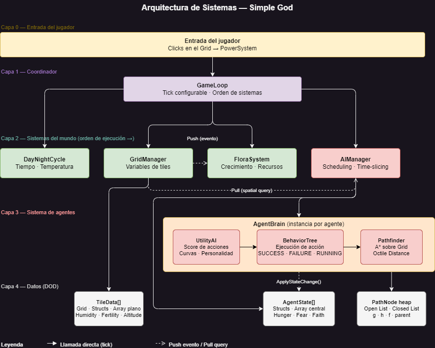
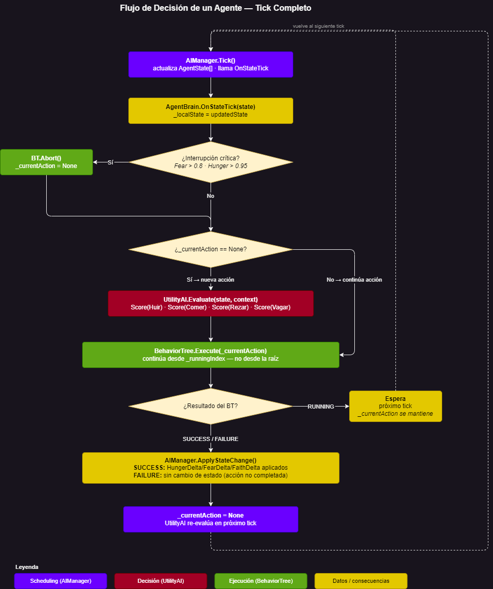
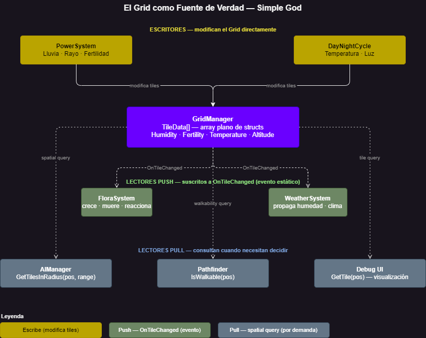

# Simple God

A systemic god game built in Unity as a technical portfolio piece. Autonomous AI agents navigate a tile-based world, balance competing needs, and react to divine interventions in real time.

**Portfolio target:** AI Engineer role at Mobius Digital Games (2026)

---

## What it is

Simple God is a top-down god game where the player influences a living ecosystem — not by direct control, but through divine powers like rain and lightning. Five villagers make autonomous decisions driven by three core needs: Hunger, Fear, and Faith. The simulation is emergent: villagers react to each other, to the environment, and to the player's interventions.

The project demonstrates the specific AI systems that matter for game AI engineering: custom behavior trees, utility-based decision making, grid-native pathfinding, and a data-oriented agent architecture built to scale.

---

## MVP Scope

| Element | Detail |
|---|---|
| World | 20×20 tile grid with humidity, fertility, temperature, altitude, and biome data |
| Agents | 5 Villagers (Rabbits and Wolves deferred to Phase 4) |
| Needs | Hunger · Fear · Faith |
| Divine Powers | Rain · Lightning |
| Perspective | Isometric 3D over a discrete 2D grid |

---

## Technical Architecture

The architecture has four layers: player input → world systems → agent system → data. The `GameLoop` orchestrates system tick order; `GridManager` is the single source of truth for world state; `AIManager` schedules agent evaluations with time-slicing to stay within frame budget.

### Behavior Trees (custom implementation)
BTs are built from scratch in C# — no Unity Behavior Package, no third-party assets. The implementation uses **BT with Memory + Selective Interruption**: nodes remember their state across frames, and high-priority interrupts (e.g. a wolf appearing mid-task) can preempt running subtrees cleanly. This is the execution layer that translates UtilityAI decisions into multi-frame actions.

### Agent Decision Flow

Per-tick flow: `AIManager` schedules the tick → `AgentBrain` updates local state → critical interrupt check (Fear > 0.8 or Hunger > 0.95 aborts current action) → if no current action, `UtilityAI` picks the next one → `BehaviorTree` executes it, resuming from `_runningIndex` rather than the root → on `SUCCESS/FAILURE`, state deltas are applied and the cycle restarts.

### Utility AI + Agent Brain
Each villager runs a `UtilityAI` scorer that weighs context (current needs, environment state, nearby entities) against a personality profile stored in `AgentBrain`. An `AIManager` schedules evaluations across frames to avoid Update spikes. The result: villagers with distinct behavior tendencies that emerge from parameters, not scripted states.

### Custom A* Pathfinding
A* implemented over the tile grid with **Octile Distance heuristic** and differentiated costs for cardinal vs. diagonal movement. Built on a `MinHeap<T>` priority queue. No NavMesh — the pathfinder is grid-native, responds instantly to dynamic tile changes (flooding, fire, obstacles), and is structured for future parallelization via Unity Job System.

### Data-Oriented Grid

The world is a flat `TileData[]` array (`y * width + x` indexing). `TileData` is a C# struct — cache-friendly, GC-free, batch-processable. Tile flags use a bitmask (`TileFlags : byte`) to encode dynamic states compactly. This is the foundation that makes large-scale simulation viable.

### Hybrid POO/DOD Agent Model
Agents separate **data** (structs: needs, position, personality) from **logic** (classes: BrainComponent, BT nodes, UtilityAI). The split keeps agent state lightweight and serializable while keeping behavior modular and testable.

---

## Architecture Decisions

All major architectural choices are documented in [`docs/architecture-decisions/`](docs/architecture-decisions/), covering: grid representation, agent-grid communication, decision architecture, BT implementation, engine choice, coordinate space, pathfinding, game loop, and state persistence (ADR-001 through ADR-010).

---

## Stack

- **Engine:** Unity 6 (LTS)
- **Language:** C#
- **Tooling:** Git, custom debug Gizmos, in-editor DevTools panel

---

## Project Status

Active development — MVP in progress. Pathfinding and core grid systems are implemented. Behavior Trees and UtilityAI integration are the current focus.
